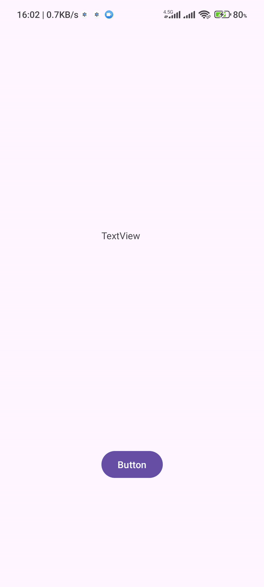

---

## Scanner



<h2>1- QR Code Scanner</h2>

**QR Code Scanner** is a powerful and easy-to-use Android application that allows users to scan and interpret QR codes. The app supports various types of QR codes, including SMS, URL, GPS coordinates, Wi-Fi credentials, and more.

## Features
The app supports scanning and extracting data from the following QR code types:

| QR Code Type        | Description |
|---------------------|-------------|
| `EXTRA_SMS`          | SMS message |
| `EXTRA_URL`          | URL link |
| `EXTRA_LATITUDE`     | Latitude coordinates |
| `EXTRA_LONGITUDE`    | Longitude coordinates |
| `EXTRA_WIFI_SSID`    | Wi-Fi SSID |
| `EXTRA_WIFI_PASSWORD`| Wi-Fi Password |
| `EXTRA_WIFI_TYPE`    | Wi-Fi Encryption type |
| `EXTRA_CALENDAR_DESC`| Calendar event description |
| `EXTRA_CONTACT_NAME` | Contact name |
| `EXTRA_DRIVER_LICENSE` | Driver license number |
| `EXTRA_EMAIL`        | Email address |
| `EXTRA_PHONE`        | Phone number |
| `EXTRA_FORMAT`       | Format of the data |
| `EXTRA_RAW_VALUE`    | Raw value from the QR code |
| `EXTRA_DISPLAY_VALUE`| Display value from the QR code |

## Code Overview

### BarcodeHelper Initialization
```kotlin
private lateinit var barcodeHelper: BarcodeHelper
```

### Scan Status Callback
```kotlin
val scanStatusCallback = object : BarcodeHelper.ScanStatusCallback {
    override fun onScanStarted() {
        println("Scan Started")
    }

    override fun onScanSuccess(result: BarcodeResult) {
        binding.textView.text = result.displayValue
    }

    override fun onScanError(errorMessage: String) {
        println("Scan Error: $errorMessage")
        binding.textView.text = errorMessage
    }
}
```

### Register for Activity Result
```kotlin
val scanLauncher =
    registerForActivityResult(ActivityResultContracts.StartActivityForResult()) { result ->
        barcodeHelper.handleScanResult(result.resultCode, result.data, scanStatusCallback)
    }
```

### Initialize BarcodeHelper
```kotlin
barcodeHelper = BarcodeHelper(this, scanLauncher)

binding.button.setOnClickListener {
    // Start scanning
    barcodeHelper.startScan(scanStatusCallback)
}
```

### Permissions
The app requires the following permission to query installed packages:
```xml
<uses-permission android:name="android.permission.QUERY_ALL_PACKAGES"/>
```

## How to Use
1. Open the app.
2. Press the **Scan** button to start scanning a QR code.
3. The result will be displayed on the screen based on the type of QR code scanned.

## Requirements
- Internet access (for scanning URLs)

## License
This project is licensed under the MIT License.

---